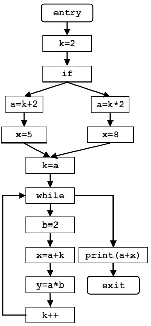
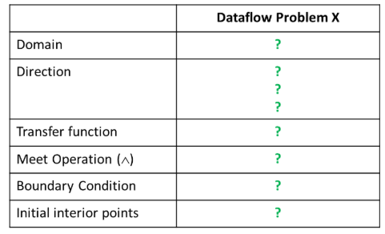
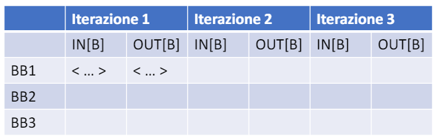

# Soluzione Esercizio 3

## Traccia

Per il programma riportato, già diviso in Basic Blocks, occorre:

- Derivare una formalizzazione per il framework di Dataflow Analysis, riempiendo lo specchietto coi parametri adeguati per il problema di **Constant Propagation**.

- Popolare una tabella con le iterazioni dell'algoritmo iterativo di soluzione del problema

L’obiettivo della constant propagation è quello di determinare in quali punti del programma le variabili hanno un valore costante.
L’informazione da calcolare per ogni nodo n del CFG è un insieme di coppie del tipo <variabile, valore costante>.
Se abbiamo la coppia <x, c> al nodo n, significa che x è garantito avere il valore _c_ ogni volta che n viene raggiunto durante l’esecuzione del programma.

## Soluzione primo punto

|                               | Dataflow Problem 3 (CP)                                                    |
|-------------------------------|------------------------------------------------------------------------------|
| **Dominio**                   | Insieme di coppie <variabile, valore costante>                          |
| **Direction**                 | Forward: $out[b] = f_b(in[b]), in[b] = (\wedge out[pred(b)])$                |
| **Transfer Function**         | $f_b(x)=gen_b(\cup(x-kill_b))$                                           |
| **Meet Operation**            | $(\cap)$                                                                   |
| **Boundary Condition**        | $out[entry]=(\{\})$                                                         |
| **Initial Interior Points**   | $out[b]=U$                                                                |

## Soluzione secondo punto

Nel programma è presente un **backedge** (BB12 $\longrightarrow$ BB8), sono state necessarie due iterazioni per arrivare a convergenza dell'algoritmo. 

| Nome BB | Contenuto | iterazione 1 - in[b] | iterazione 1 - out[b] | iterazione 2 - in[b] | iterazione 2 - out[b] |
|---------|-----------|-----------------------|------------------------|-----------------------|------------------------|
| entry   | {}        | {}                    | {}                     | {}                    | {}                     |
| BB1     | k=2       | out[entry]            | {(k,2)}                | out[entry]            | {(k,2)}                |
| BB2     | if        | out[BB1]              | {(k,2)}                | out[BB1]              | {(k,2)}                |
| BB3     | a=k+2     | out[BB2]              | {(a,4), (k,2)}         | out[BB2]              | {(a,4), (k,2)}         |
| BB4     | x=5       | out[BB3]              | {(x,5), (a,4), (k,2)}  | out[BB3]              | {(x,5), (a,4), (k,2)}  |
| BB5     | a=k*2     | out[BB2]              | {(a,4), (k,2)}         | out[BB2]              | {(a,4), (k,2)}         |
| BB6     | x=8       | out[BB5]              | {(x,8), (a,4), (k,2)}  | out[BB5]              | {(x,8), (a,4), (k,2)}  |
| BB7     | k=a       | out[BB4] $\cup$ out[BB6]     | {(a,4), (k,4)}         | out[BB4] $\cup$ out[BB6]     | {(a,4), (k,4)}                |
| BB8     | while     | out[BB7] $\cup$ out[BB12]    | {(a,4)}                | out[BB7] $\cup$ out[BB12]    | {(a,4)}                |
| BB9     | b=2       | out[BB8]              | {(b,2), (a,4)}         | out[BB8]              | {(b,2), (a,4)}         |
| BB10    | x=a+k     | out[BB9]              | {(x,8), (b,2), (a,4)}  | out[BB9]              | {(b,2), (a,4)}  |
| BB11    | y=a*b     | out[BB10]             | {(y,8), (b,2), (a,4)}  | out[BB10]             | {(y,8), (b,2), (a,4)}  |
| BB12    | k++       | out[BB11]             | {(k,5), (y,8), (x,8), (b,2), (a,4)} | out[BB11]    | {(y,8), (b,2), (a,4)} |
| BB13    | print(a+x) | out[BB8]             | {(a,4)}                | out[BB8]              | {(a,4)}                |
| exit    | {}        | out[BB13]            | {(a,4)}                | out[BB13]             | {(a,4)}                |
